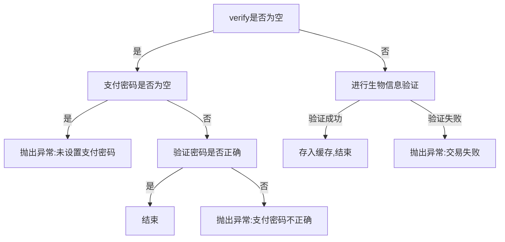
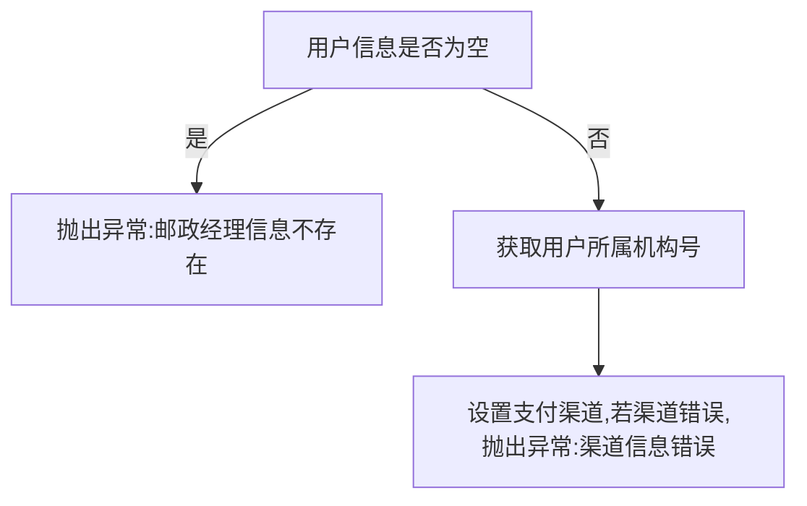
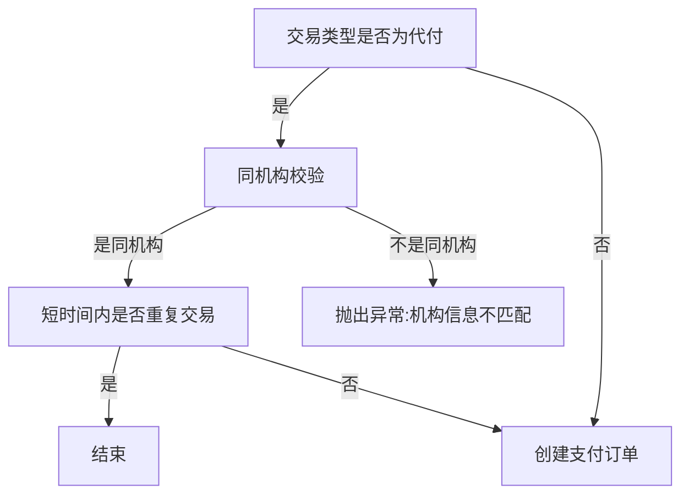
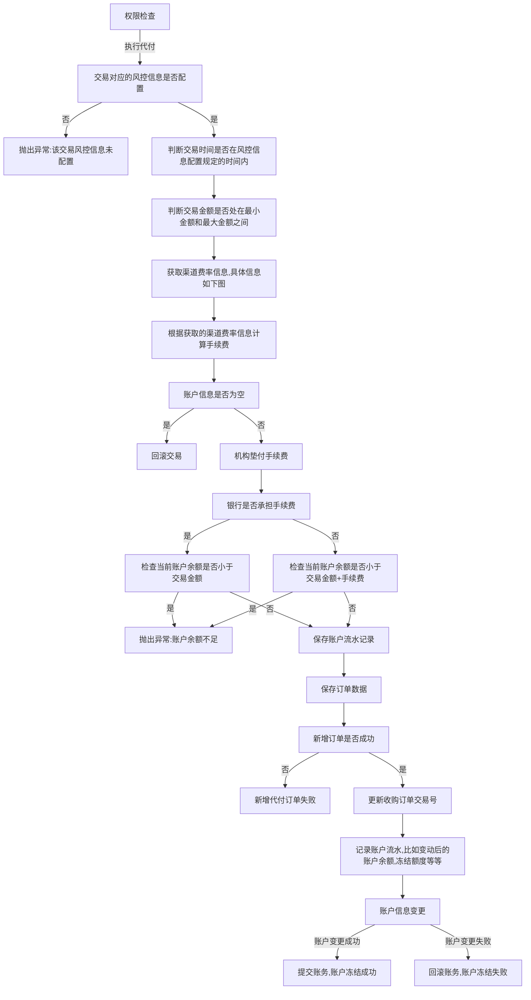
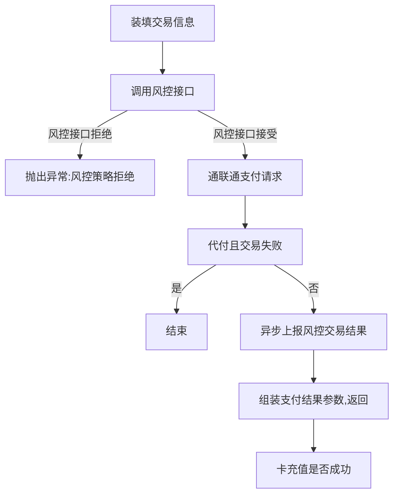

## 卡充值是什么

指用户通过绑定的银行卡转入app内的余额，很多app都会有这个功能，典型的有微信的零钱和支付宝的余额。

挖个坑，为什么余额宝必须转入余额，才能转出到银行卡，而余额宝可以直接通过银行卡充值。

## 卡充值的流程

### 代收开始

传入相应的参数，比如密码、认证方式、充值数额

### 支付认证

如果认证方式为空，则检查支付密码是否为空，以及支付密码是否正确

如果认证方式不为空，则进行生物信息验证（指纹、面容等）

### 组装支付参数

| 参数名     | 描述             | 备注                                                         |
| ---------- | ---------------- | ------------------------------------------------------------ |
| userId     |                  |                                                              |
| txnCd      | 交易类型         | 代收(√)、代付、签约、账户、POS                               |
| txnAmt     | 充值时的选取金额 |                                                              |
| cardNo     | 卡号             |                                                              |
| cardName   | 用户名           |                                                              |
| detailType | 详细类型         | 代收（√）、代付、提现、网银充值、POS充值                     |
| systemType |                  | 00                                                           |
| agrmno     | 快捷签约协议号   | 如未快捷签约，返回空串。tbl_bind_card的ext1字段代表快捷签约协议号。默认走商委渠道 |
| ip         | ip地址           |                                                              |

### 支付网关

#### 组装订单信息

将交易金额传入订单信息中

将订单信息放入支付参数中

#### 校验卡信息

#### 基本信息检查

检查用户是否存在

检查用户状态是否为00：   状态编码，00启用，01禁用  03 待审核  04 注销 05 未通过 06 删除

检查交易类型，用户是否开通该交易类型

校验银行信息，卡号是否支持

#### 路由渠道以及渠道商户号

路由信息

根据交易类型和路由状态，得到路由列表

寻找路由列表中路由等级为0的作为默认路由

根据默认路由信息得到的渠道代码和机构号，获取渠道信息

#### 代收不涉及这部分校验，直接创建支付订单

#### 创建支付订单

权限检查

