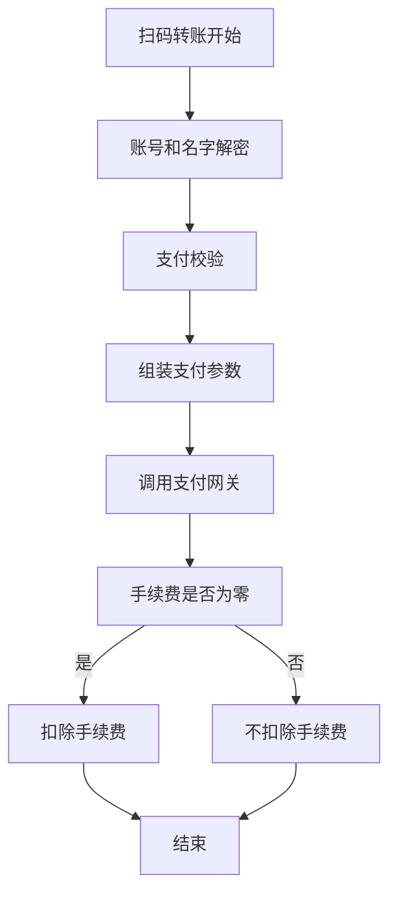
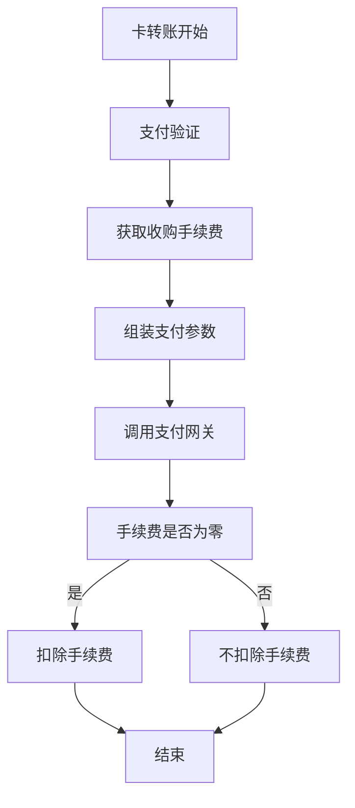
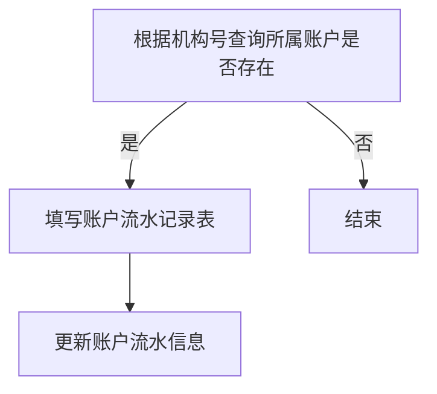
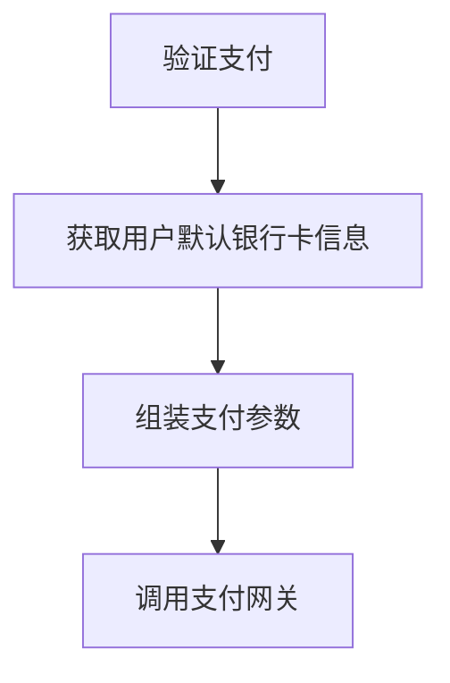
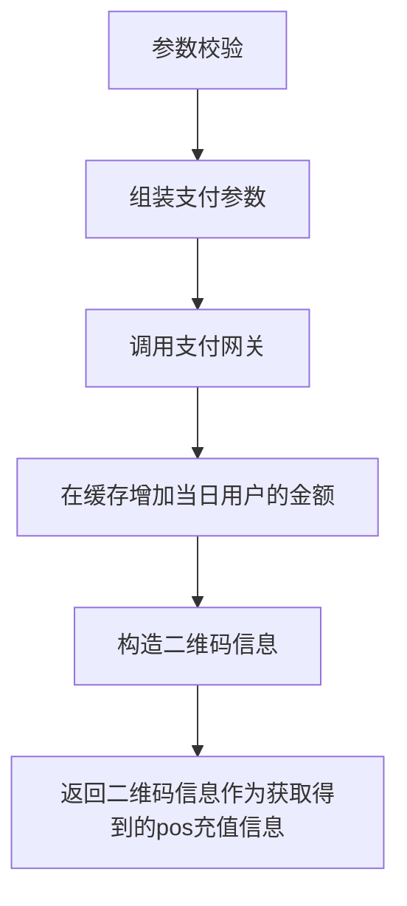
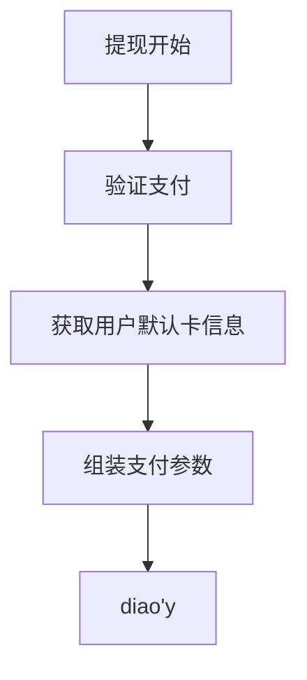

# 工作日志

## 七月

### 7.5（基础的开发环境）

#### 配置了jdk、idea、mysql、maven、git、mybatis-plus环境

#### 画微信付款码使用的时序图

时序图中返回的信息要用虚线、且时序图的步骤要标清楚1、2、3、4····

微信、支付宝可以离线支付

### 7.6（项目开发环境）

#### 将项目配置到本地，运行起来一部分

- maven配置在build tools改maven的path、settings（替换了原来的settings）、repository

- project structure可以改jdk1.8的路径

- reload、download引入maven的依赖配置，最后build项目，build以后跑admin、gateway、master、ariesjob、Iron这四个application。

- 其中在运行遇到了IcsPlateformAdminApplication时遇到了scannerExcecption，参考https://blog.csdn.net/weixin_40910372/article/details/108199525这个博客解决了问题，但是我还没有看懂，也许需要学一下springboot才可以看懂，主要就是在当前文件的pom中的build中添加了以下配置
- ```xml
  <resources>
      <resource>
          <directory>src/main/resources</directory>
          <!--开启过滤，用指定的参数替换directory下的文件中的参数-->
          <filtering>true</filtering>
      </resource>
  </resources>
  ```

- 重新引入sfs包时出现了错误，删除base打头的包，通过在编译器打开新的sfs包，maven-->lifecycle-->clean、compile、install，消除报错（要记得改仓库地址，要不然每次都要把东西下载到D盘QAQ）

### 7.7（熟悉项目代码）

#### 熟悉项目中的代码

##### 三层架构编程

用户视图层：与用户交互、展示或接收数据

业务逻辑层：对视图层传入的数据进行判断、验证、组装（接口：定义类，实例化对象，属于业务逻辑层）

数据访问层：负责最终数据的存储和读取（models：用来封装对象，没有什么特别的功能）

Entity层（pojo层）：实体层，数据库在项目中的类，该文件包含实体类的属性和对应属性的set、get方法

DAO层（也就是mapper层）：持久层，主要与数据库进行交互。mybatis逆向生成的mapper层，其实就是DAO层。

- DAO层会调用entity层，DAO中会定义实际使用到的方法，比如增删改查。
- DAO层的数据源和数据库连接的参数都是在配置文件（一般在同层的XML文件夹中）中进行配置的。
- 数据持久化操作：把数据放到持久化的介质中，同时提供增删改查操作

Service层：业务层，控制业务。主要负责业务模块的逻辑应用设计。

- 先设计放接口的类，再创建实现的类，在配置文件中进行配置其实现的关联
- service层调用dao层接口，接受dao层返回的数据，完成项目的基本功能设计
- 封装service层的业务逻辑有利于业务逻辑的独立性和重复利用性

Controller层：控制层，控制业务的逻辑。Controller层负责具体的业务模块流程的控制。

- controller层负责前后端交互，接受前端请求、调用service层，接收service层返回的数据，最后返回具体的页面和数据到客户端。

在具体的项目中，流程：

Controlller-->service接口-->serviceImpl-->dao接口-->mapper-->db

Controller层调用Service层的方法，Service层调用Dao层中的方法，其中调用的参数是使用Entity进行传递的。

#### spring boot

application.yml：和application.properties功能相同，不同的是yml是树状结构，位于resources下。

#### Lombok

@Slf4j :这是lombok的一个注解，简化了日志的使用，自动创建了一个log的日志对象，可以直接使用

#### Java接口

Serializable:Java提供的用于实现对象序列化和反序列化的接口。通过实现该接口，可以将对象转换为字节序列进行持久化或传输，在需要时重新将字节序列转换回对象。

#### MyBatis

通过entity和entityservice生成在resources下的mapper，自动生成数据库的一些语句

#### spring

@Controller:标识一个类是Spring MVC中的控制器。它表示这个类将用于处理http请求，根据请求的路径、参数等执行相应的操作。与其他注解（@RequestMapping、@GetMapping、@PostMapping）一起使用，用于定义请求、映射和处理。

@ResponseBody:标识一个方法的返回值直接作为响应体返回给客户端，而不是根据视图解析器解析为视图。使用@ResponseBody注解时，方法的返回值会被转换为适当的格式并作为http相应内容返回给客户端。

#### RESTful

是目前最流行的接口设计规范，

REST(Representation State Transfer)是一种软件架构风格、设计风格，不是标准，只是提供了一组设计原则和约束条件，主要用于客户端和服务器交互类的软件。符合REST架构风格的接口被称为RESTful API。

REST风格的特征：

- 以资源为基础：资源可以是一个图片、音乐、一个XML格式、HTML格式或者JSON格式等网络上的一个实体，除了一些二进制的资源外普通的文本资源更多以JSON为载体、面向用户的一组数据(通常从数据库中查询而得到)。

- 统一接口：对资源的操作包括获取、创建、修改和删除，这些操作正好对应HTTP协议提供的GET、POST、PUT和DELETE方法。换言而知，使用RESTful风格的接口但从接口上你可能只能定位其资源，但是无法知晓它具体进行了什么操作，需要具体了解其发生了什么操作动作要从其HTTP请求方法类型上进行判断。具体的HTTP方法和方法含义如下

  

- - GET（SELECT）：从服务器取出资源（一项或多项）。
  - POST（CREATE）：在服务器新建一个资源。
  - PUT（UPDATE）：在服务器更新资源（客户端提供完整资源数据）。
  - PATCH（UPDATE）：在服务器更新资源（客户端提供需要修改的资源数据）。
  - DELETE（DELETE）：从服务器删除资源。
    

REST架构限制条件（RESTful6大原则）

- **客户端-服务端（Client-Server）**: 这个更专注客户端和服务端的分离，服务端独立可更好服务于前端、安卓、IOS等客户端设备。
- **无状态（Stateless）**：服务端不保存客户端状态，客户端保存状态信息每次请求携带状态信息。
- **可缓存性（Cacheability）** ：服务端需回复是否可以缓存以让客户端甄别是否缓存提高效率。
- **统一接口（Uniform Interface）**：通过一定原则设计接口降低耦合，简化系统架构，这是RESTful设计的基本出发点。当然这个内容除了上述特点提到部分具体内容比较多详细了解可以参考这篇[REST论文内容](https://link.zhihu.com/?target=https%3A//www.ics.uci.edu/~fielding/pubs/dissertation/rest_arch_style.htm)。
- **分层系统（Layered System）**：客户端无法直接知道连接的到终端还是中间设备，分层允许你灵活的部署服务端项目。
- **按需代码（Code-On-Demand，可选）**：按需代码允许我们灵活的发送一些看似特殊的代码给客户端例如JavaScript代码。

#### 项目代码结构

总部驾驶舱：通联公司高层领导、部门的人看的

管理平台

数据库表

用户：通联分公司层级结构、银行、机构商户层级结构(两棵树有交叉，机构分公司有可能被通联分公司代运营)

t_company_table\gw_org_info\t_org_relation(数据权限)

gw_userinfo已经废掉了

用户角色表、用户表、用户角色关联表、（t开头的）

代码层级结构：

补微服务相关的知识、项目

aries-report:用的微服务，

zlt-config:配置中心

一定要改spring.profiles.active=test(测试运行用哪个test改成什么)

所有请求都经过网关，校验，分到对应的微服务中

channel：和web系统交互

job：

master：用户服务、系统服务

report：导出要掉的服务

business：最主要的服务，iron

白名单：网关放行，不校验，直接放行

开发规范：

自动生成代码工具，类的名称、方法名称长度注意

框架：mybatis（联合查询）+jpa（针对单表）

多加注释

获得用户属性：固定形式

分页查询：固定形式

数据库：默认的本地的。数仓@DS（“doris”）

service-->entityService

@DataScope 权限过滤

尽量规范

不要用select *，子查询尽量缩小

iron -->doris 9003 pom修改

测试环境：conflence教程

注册中心：阿里的nacos

开发远程调用、测试

设计书：看过，放到confluence

挡板数据

自己开发的功能要自测

业务bean，

### 7.10（postman、音箱交易查询的数据源切换）

#### 熟悉代码

#### 在SoundTransManagerMapper.xml文件上的数据源切换

在SoundTransManagerMapper.xml文件上进行根据[经管平台数据源切换DB表结构整理(应用端) (qq.com)](https://docs.qq.com/sheet/DSVBXT0JEWkx4QWt2?tab=BB08J2)这个表进行修改。修改部分主要是

ods_syb_device_record-->ods_syb_cusiotvoiceinfo

这个表下面的cus_id-->cusid,sn-->devicename

#### 学习使用postman测试工具

配置token

### 7.11（音箱交易查询的测试）

#### SoundTransManagerMapper.xml文件记录

sql中case的使用

findSoundTransQueryListByParam：

商户号、商户名、最后一笔交易信息、device.devicename：设备序列号、tr_amt、devicenum音箱数

dws_syb_merchant_features_df：cus_id, cus_name ,now_bind_suona_num

ods_syb_cusiotvoiceinfo这个表中与dws_syb_merchant_features_df这个表中有相同的商户号的部分：cusid, devicename

ads_syb_cus_trx_analyse_info这个表中与dws_syb_merchant_features_df这个表中有相同的商户号的部分：lst_trx_day ,cus_id


#### 对修改过的SoundTransManagerMapper.xml文件进行测试

postman测试本地地址时，前面的端口写http://localhost:9900/，不要绕过网关，否则会报服务器内部错误500

报表导出的时候要启动master，否则也会报500

要在配置文件上修改访问的网址，提交之前要把修改过的其他内容修改回来

git clone 远程仓库地址，开发要在正确的分支上开发

| 测试功能 | 测试条件                                                     | 结果                                                         | 输出文件名         |
| -------- | ------------------------------------------------------------ | ------------------------------------------------------------ | ------------------ |
|          | 交易日期（2023.06.11-2023.07.10）、有无交易（有交易）、机构名称（中国邮政集团有限公司湖南省分公司） |  | myDictionary1.json |
|          | 交易日期（2023.06.11-2023.07.10）、有无交易（无交易）、机构名称（中国邮政集团有限公司湖南省分公司） |  | myDictionary2.json |
|          |  |  | 3                  |
|          |  |  | 4                  |
|          |  |  | 5                  |
|          |  |  | 6                  |
|          |  |  | 7                  |
|          |  |  |                    |
|          |  |  |                    |
|          |  |  |                    |

#### 测试遇到的无关紧要的问题？

本地生成的报表和开发环境生成的报表同一个商户下，音箱序列排序不同，比如


本地和开发环境导出报表时，有一定概率导出失败


SoundTransManagerMapper.xml写了两个一样的语句


#### 今日想法

学习一下网关相关知识

没有将git的相关知识和idea中的图形化界面结合起来，应该仔细学习一下git知识

有关动态sql的学习

### 7.12（学习网关、git、动态sql）

#### 动态sql标签

是MyBatis的强大特性

元素种类

if：

```sql
<select id="findActiveBlogWithTitleLike"
     resultType="Blog">
  SELECT * FROM BLOG
  WHERE state = ‘ACTIVE’
  <if test="title != null">
    AND title like #{title}
  </if>
</select>
```

choose、when、otherwise

```sql
<select id="findActiveBlogLike"
     resultType="Blog">
  SELECT * FROM BLOG WHERE state = ‘ACTIVE’
  <choose>
    <when test="title != null">
      AND title like #{title}
    </when>
    <when test="author != null and author.name != null">
      AND author_name like #{author.name}
    </when>
    <otherwise>
      AND featured = 1
    </otherwise>
  </choose>
</select>
```

trim、where、set

如下所示，当“state = ‘ACTIVE’” 设置成动态条件时：

如果没有匹配条件，则只有where

如果第二个条件匹配，则where AND title like

```sql
<select id="findActiveBlogLike"
     resultType="Blog">
  SELECT * FROM BLOG
  WHERE
  <if test="state != null">
    state = #{state}
  </if>
  <if test="title != null">
    AND title like #{title}
  </if>
  <if test="author != null and author.name != null">
    AND author_name like #{author.name}
  </if>
</select>
```

*where* 元素只会在子元素返回任何内容的情况下才插入 “WHERE” 子句。而且，若子句的开头为 “AND” 或 “OR”，*where* 元素也会将它们去除。

```sql
<select id="findActiveBlogLike"
     resultType="Blog">
  SELECT * FROM BLOG
  <where>
    <if test="state != null">
         state = #{state}
    </if>
    <if test="title != null">
        AND title like #{title}
    </if>
    <if test="author != null and author.name != null">
        AND author_name like #{author.name}
    </if>
  </where>
</select>
```

如果 *where* 元素与你期望的不太一样，你也可以通过自定义 trim 元素来定制 *where* 元素的功能。比如，和 *where* 元素等价的自定义 trim 元素为

foreach

```sql
<select id="selectPostIn" resultType="domain.blog.Post">
  SELECT *
  FROM POST P
  <where>
    <foreach item="item" index="index" collection="list"
        open="ID in (" separator="," close=")" nullable="true">
          #{item}
    </foreach>
  </where>
</select>
```

#### 网关

又称网间连接器、协议转换器。

在使用不同的通信协议、数据格式或语言，甚至体系结构完全不同的两种系统之间，网关是一个**翻译器**。与网桥只是简单地传达信息不同，网关对收到的信息要重新打包，以适应目的系统的需求。同时，网关也可以提供**过滤和安全**功能。大多数网关运行在OSI 7层协议的顶层--应用层。

在OSI中，网关有两种：一种是面向连接的网关，一种是无连接的网关。*当两个子网之间有一定距离时，往往将一个网关分成两半，中间用一条链路连接起来，我们称之为半网关。*

##### IP地址

IP地址（Internet Protocol Address 互联网国际地址）是一种在Internet上的给主机编址的方式，它主要是为互联网上的每一个网络和每一台主机分配一个逻辑地址，以此来屏蔽物理地址的差异。

IP地址由网络号与主机号两部分共32位组成，总共4段，每段用“.”隔开，被称为“点分十进制表示法”，如：192.168.1.1

###### IP地址分类


注：A类地址子网号:0-127，其中0代表任何地址，127为回环测试地址（ 计算机以回环地址发送的消息，并不会由链路层送走，而是被本机网络层捕获。用处只有一个，就是自己发给自己，自娱自乐。），因此，A类ip地址的实际范围是1-126.

0.0.0.0:这个地址用于指代本机的所有ip地址，当然也包括回环地址。如果本机有多个网卡，那么0.0.0.0就代表所有网卡的ip加上所有的回环地址

0.0.0.0与127.0.0.1的异同

- 0.0.0.0包含127.0.0.1，都代表本机。（仅从本机视角去看）
- 0.0.0.0和127.0.0.1对其他主机都不可见
- 0.0.0.0代表一个ip集合，无法访问；127是单个ip可以访问

IP地址还分为私网地址和公网地址，其中私网地址只能在局域网内部使用，不能访问Internet。

私有IP地址：

①　A类：10.0.0.0-10.255.255.255

②　B类：172.16.0.0-172.31.255.255

③　C类：192.168.0.0-192.168.255.255

④　自动私有地址：169.254.0.0/16（当计算机无法获取IP地址时自动配置）

特殊地址：

本地环回地址：127.0.0.1（测试本机的网络配置，能ping通127.0.0.1说明本机的网卡和IP协议安装都没有问题）

本地广播地址：255.255.255.255

##### 子网掩码

用来分隔子网和区分哪些是同一个网段，哪些不是同一网段的

通过子网掩码可得知IP地址的网络位

ip地址：192.168.1.1 子网掩码：255.255.255.0

ip地址：192.168.1.2 子网掩码：255.255.0.0

这两个ip地址虽然在不看掩码的情况下，像是一个网段的，但他们并不是同一个网段内的。

这个可以从子网掩码来判断，192.168.1.1 255.255.255.0是属于192.168.1.0网段的。

而192.168.1.2 255.255.0.0是属于192.168.0.0网段。

##### 子网划分

###### 目的：

常用的A、B、C三类的地址范围比较大，在我们规划IP时，容易造成IP地址浪费，为了提高IP地址的利用率，将ABC三个类别的地址在利用掩码进行再划分成更细的网段，减少空闲IP的浪费。

###### 原理：

IP地址由网络位+主机位组成，子网划分就是借用现有网段的主机位的最左边某几位作为子网位，划分出多个子网。

①把原来有类网络IPv4地址中的“网络号”部分向“主机号”部分借位

②把一部分原来属于“主机号”部分的位变成“网络号”的一部分（通常称之为“子网号”）。


因此IP地址进行转变：网络号+主机号 变成 网络号+子网号（m）+主机号（n）

划分后子网数量：2^m

划分后每个子网可用主机数：2^n-2（主机号全为0和全为1（指二进制）的ip地址分别为网络地址与广播地址，是不能分配给某个特定的主机使用的）

###### 子网划分步骤：

①　确定所需子网数2^m，

②　确定每个子网可用主机数2^n-2

③　确定需像主机号部分借多少位（m），才能满足需要求

④　根据主机数可得知子网地址空间大小2^n

⑤　进行地址划分

###### 子网划分实例

某公司有四个部门，每个部门拥有50台主机，分配一个C类地址200.161.30.0/24,请问如何进行网络地址规划？

a.确定子网数：四个部门，2^m>=4

b.确定主机数：50台主机，2^n-2>=50

c.C类地址网络号位24位，主机位8位，向第四段主机位借位，由上可知子网位m=2，主机位n=6

d.子网空间为64，子网数为4，根据原主机位八位则原网络空间为0-255，共256个，此时我们算出子网空间为64，可得出四个子网范围0-63、64-127、127-192、192-255

e. 第一个子网200.161.30.0/26-200.161.30.63/26

第二个子网200.161.30.64/26-200.161.30.127/26

第三个子网200.161.30.128/26-200.161.30.191/26

第四个子网200.161.39.192/26-200.161.30.255/26


f.主机位全为0和1的地址分别为网络地址与广播地址，不能分配给主机使用，则

部门1地址范围：200.161.30.1-62/26

部门2地址范围：200.161.30.65-12/26

部门3地址范围：200.161.30.129-190/26

部门4地址范围：200.161.30.193-254/26

##### TCP/IP协议下的网关

一个网络通向其他网络的IP地址。

网络A的IP地址范围为

“192.168.1.1~192. 168.1.254”，

子网掩码为

255.255.255.0；

网络B的IP地为

“192.168.2.1~192.168.2.254”，

子网掩码为

255.255.255.0。

#### git

##### 版本控制

通过版本控制系统（VCS）,使⽤者可以进⾏如下操作： 

- 避免了我们在本地复制整个项⽬来保存不同版本的麻烦操作。
- 清楚地查到某个⽂件或者某个⽬录的所有修改变更记录，包括变更的内容、谁在何时进⾏了何种修改等。 
- ⽐较不同版本⽂件的变化细节 将⽂件内容回溯到任何⼀个已提交的版本节点
- 在出现问题需要回溯版本时最⼩化操作难度

##### 工作流程

| git有三种状态：已提交（committed）、已修改(modified)、已暂存(staged) | 与之对应的三个概念                         |
| ------------------------------------------------------------ | ------------------------------------------ |
| 已修改：在本地修改了文件，但还没保存到数据库中               | 工作目录：本地开发的项目                   |
| 已暂存：对修改文件的当前版本进行标记，将它包含在下一次提交的快照中 | 暂存区：保存了下一次需要提交的文件列表信息 |
| 已提交：安全保存到数据库中                                   | git仓库：用来保存项目数据的地方，git的核心 |


##### 基础配置

配置用户信息：根据name和email，在code review出问题的时候，找到指定的相关人员

```
git config --global user.name <name>
git config --global user.email <email>
```

查看所有配置

```
git config --list
```

查看某个配置

```
git config <key>
```

##### git基础

1.创建版本仓库：

进入项目目录，执行以下命令

```
git init 
```

2.复制某个版本库到本地

```
git clone <repo>
```

3.添加指定文件

```
git add <directory>
```

4.提交到暂存区的修改

```
git commit -m  "<message>"
```

5.查看项目文件状态

显示哪些文件已被staged、未被staged以及未跟踪

```
git status
```

6.查看提交历史

```
git log
```

7.进行比较

```
git diff
```

注：带上HEAD⽤于⽐较⼯作区和上⼀次commit后的修改，带上--cached⽤于⽐较暂存区和上⼀次commit后的修改

##### 远程仓库管理

1.更新本地代码

更新本地仓库同时同步当前工作分支

```
git pull <remote>
```

2.更新远端仓库代码

将本地指定推送到指定远程仓库。如果远程没有对应的分⽀，将⾃动在远程创建此分⽀。不带两个参数则默认将当前所在分⽀的代码提交到远端

```
git push <remote><branch>
```

3.关联远程库

```
git remote add <name><url>
```

##### 日常使用

```
git add . #这个命令会将整个项⽬中发⽣修改的⽂件全都添加到暂存区
git status #⽤于查看已添加到暂存区的⽂件内容
git commit -m “<message>” #提交变更到本地仓库
git pull #拉取远端对应分⽀代码，如果同分⽀有其他变更会先在本地进⾏merge再提交
git push #更新远端对应分⽀代码
```

##### 来自：[Git使用说明手册.pdf](C:/Users/allinpay/Documents/WeChat Files/wxid_nnkqhjqwvsgw22/FileStorage/File/2023-07/Git使用说明手册.pdf)

##### 通用步骤

把远程某个分支上的内容拉取到本地

```
git pull origin devlop(远程分支名称)
```

提交本地分支代码到远程分支：

- 将代码提交到暂存区

  ```
  git add .
  ```

- 添加提交信息

  ```
  git commit -m "提交的信息"
  ```

- 提交本地分支代码到远程分支（该命令应该在本地分支下执行）

  ```
  git push origin develop(远程分支名称/和本地名称相同)
  ```

#### springboot集成@DS注解

@DS注解实现数据源切换

核心：添加@DS注解到实现类（该类里的方法都使用此数据源）或者实现类的方法（此方法上使用的数据源优先级高于其他一切配置）上才有效。（添加到mapper、interface service类、interface service方法上都无效）。

#### spring框架中的@RequestParam

@RequestParam：将请求参数绑定到控制器的方法参数上（springmvc中接收普通参数的注解）

- value：请求参数名（必须配置） 
- required：是否必需，默认为 true，即 请求中必须包含该参数，如果没有包含，将会抛出异常（可选配置） 
- defaultValue：默认值，如果设置了该值，required将自动设为 false，无论你是否配置了required，配置了什么值，都是 false（可选配置）

#### 若依框架中的@DataScope

若依框架本身具有角色、部门、用户业务。
在业务中，用户必须绑定一个角色，而角色又必须将自身绑定到部门，角色绑定了哪些部门，就决定着隶属于该角色的用户能对哪些部门数据进行增删改。
那么，怎么实现让用户只能遵循其绑定角色所指定的部门，来进行数据范围控制呢？
一般情况下，假如我们对一张表要进行查询或更新的话，需要在sql语句中，where条件语法后面加上 dept.id = {currentDeptId} 来进行过滤，例如

```sql
select * from sys_user
where dept_id = {currentUserDeptId}
```

但是，在若依框架中，我们只需要在Service层的方法上加入`@DataScope`注解，
并分别通过deptAlias和userAlias属性，指定出部门表和用户表在sql语句中的别名是什么的话，
就不需要我们手动在sql语句后面加上过滤条件了。

###### 使用方法

1.我们有一个部门表的实体类，叫SysDept。并且，它还必须继承了BaseEntity这个类。


而BaseEntity实体类中，有一个类型为map,名称为[params](https://so.csdn.net/so/search?q=params&spm=1001.2101.3001.7020)的属性。


2.在对应的mapper.xml文件中，对应sql语句的末尾，我们引用SysDept所继承的BaseEntity父类中的’params’属性。


3.在service层方法加@DataScope注解，并指定sql语句中用户表和部门表的别名。


4.接下来我们前端访问controller，debug然后进入到service层的这个方法，我们会惊奇的发现。SysDept所继承的BaseEntity父类的params属性，有了值。而这个值，就是数据过滤相关的sql语句


若依框架会根据访问该方法的前端用户所绑定的角色，自动生成相应的sql语句给BaseEntity类的params属性，进而在mapper.xml中引用它，来实现数据权限范围的控制。

###### 原理

那么，既然使用了@DataScope后，就会根据前端用户的相关权限参数，自动来生成sql语句用以过滤。
那就很好奇了，
1，这个sql语句是在哪儿生成的？
2，前端用户的权限，肯定也是需要通过响应的判断，来生成的吧，那么在哪儿判断的？
3，假如它当前自动生成的sql语句，不符合我的现在业务的需求，我怎么去该？
4，它是如何实现的？

其实这是若依框架通过一个叫做‘DataScopeAspect'的切面类来实现的


在从controller进入service层之前，凡是service层使用了@DataScope注解的方法，都会先执行这个切面类，再去执行service层方法。
以其中的’dataScopeFilter‘方法举例子，它会判断当前的角色id，去生成对应的sql语句，然后赋值给BaseEntity的params属性，


### 7.13

#### lombok中的@SneakyThrows

##### java的异常体系


Error：编译时错误和系统错误，系统错误基本不会出现。编译错误，编译器会提示

Exception：被抛出的基本类型，分为RunTimeException和其他Exception

- RunTimeException：运行时异常（不受检查异常），
- 其他Exception：受异常检查，必须开发者解决以后才能编译通过，解决方法有两种
  - throw到上层
  - try-catch处理

##### @SneakyThrows的作用

普通Exception类,也就是我们常说的受检异常或者Checked Exception会强制要求抛出它的方法声明throws，调用者必须显示的去处理这个异常。设计的目的是为了提醒开发者处理一些场景中必然可能存在的异常情况。比如网络异常造成IOException。

但是现实大部分情况下的异常，我们都是一路往外抛了事。所以渐渐的java程序员处理Exception的常见手段就是外面包一层RuntimeException，接着往上丢

```java
try{
}catch(Exception e){
throw new RuntimeException(e);
}
```

消除这样的模板代码，使用注解后不需要担心Exception的处理

```java
import lombok.SneakyThrows;

public class SneakyThrowsExample implements Runnable {
  @SneakyThrows(UnsupportedEncodingException.class)
  public String utf8ToString(byte[] bytes) {
    return new String(bytes, "UTF-8");
  }
  
  @SneakyThrows
  public void run() {
    throw new Throwable();
  }
}
```

通过编译器生成真正的代码

```java
import lombok.Lombok;

public class SneakyThrowsExample implements Runnable {
  public String utf8ToString(byte[] bytes) {
    try {
      return new String(bytes, "UTF-8");
    } catch (UnsupportedEncodingException e) {
      throw Lombok.sneakyThrow(e);
    }
  }
  
  public void run() {
    try {
      throw new Throwable();
    } catch (Throwable t) {
      throw Lombok.sneakyThrow(t);
    }
  }
}
```

##### 原理

显然魔法藏在Lombok.sneakyThrow(t);中。可能大家都会以为这个方法就是new RuntimeException()之类的。然而事实并非如此。阅读代码可以看出整个方法其实最核心的逻辑是throw (T t);，利用泛型将我们传入的Throwable强转为RuntimeException。虽然事实上我们不是RuntimeException。但是没关系。因为JVM并不关心这个。泛型最后存储为字节码时并没有泛型的信息。这样写只是为了骗过javac编译器。源码中注释有解释。

```java
    public static RuntimeException sneakyThrow(Throwable t) {
        if (t == null) throw new NullPointerException("t");
        return Lombok.<RuntimeException>sneakyThrow0(t);
    }

    private static <T extends Throwable> T sneakyThrow0(Throwable t) throws T {
        throw (T)t;
    }
```

#### mybatis:自定义实现拦截器Interceptor

##### mybatis可以被拦截的类型

Executor：拦截执行器的方法

ParameterHandler：拦截参数的处理

ResultHandler：拦截结果集的处理

StatementHandler：拦截Sql语法构建的处理

##### 规则

Intercepts注解需要一个Signature（拦截点）参数数组。通过Signature来指定拦截哪个对象里面的哪个方法。

@Intercepts注解定义如下

```java
@Documented
@Retention(RetentionPolicy.RUNTIME)
@Target(ElementType.TYPE)
public @interface Intercepts {
    /**
     * 定义拦截点
     * 只有符合拦截点的条件才会进入到拦截器
     */
    Signature[] value();
}
```

#### @Retention

作用：定义被它所注解的注解保留多久，共有三种策略，定义在RetentionPolicy枚举中.

source：注解只保留在源文件，当java文件编译成class文件的时候，注解被遗弃

class：注解被保留到class文件，jvm加载class文件之后，仍然存在

runtime：注解不仅被保存到class文件中，jvm加载class文件之后，仍然存在

这3个生命周期分别对应于：Java源文件(.java文件) ---> .class文件 ---> 内存中的字节码。

那怎么来选择合适的注解生命周期呢？

首先要明确生命周期长度 SOURCE < CLASS < RUNTIME ，所以前者能作用的地方后者一定也能作用。一般如果需要在运行时去动态获取注解信息，那只能用 RUNTIME 注解；如果要在编译时进行一些预处理操作，比如生成一些辅助代码（如 [ButterKnife](https://github.com/JakeWharton/butterknife)），就用 CLASS注解；如果只是做一些检查性的操作，比如 @Override 和 @SuppressWarnings，则可选用 SOURCE 注解。

##### 运用

需要通过反射来获取运行时注解，可以从 Package、Class、Field、Method...上面获取，基本方法都一样，几个常见的方法如下：

```java
/**
* 获取指定类型的注解
*/
public <A extends Annotation> A getAnnotation(Class<A> annotationType);
/**
* 获取所有注解，如果有的话
*/
public Annotation[] getAnnotations();
/**
* 获取所有注解，忽略继承的注解
*/
public Annotation[] getDeclaredAnnotations();
/**
* 指定注解是否存在该元素上，如果有则返回true，否则false
*/
public boolean isAnnotationPresent(Class<? extends Annotation> annotationType);
/**
* 获取Method中参数的所有注解
*/
public Annotation[][] getParameterAnnotations();
```

要使用这些函数必须先通过反射获取到对应的元素：Class、Field、Method 等。

##### 自定义注解

```java
// 适用类、接口（包括注解类型）或枚举
@Retention(RetentionPolicy.RUNTIME)
@Target(ElementType.TYPE)
public @interface ClassInfo {
String value();
}
// 适用field属性，也包括enum常量
@Retention(RetentionPolicy.RUNTIME)
@Target(ElementType.FIELD)
public @interface FieldInfo {
int[] value();
}
// 适用方法
@Retention(RetentionPolicy.RUNTIME)
@Target(ElementType.METHOD)
public @interface MethodInfo {
String name() default "long";
String data();
int age() default 27;
}
```

##### 注解

注解：给代码添加元数据（关于数据的数据）的方式，以此提供某些功能信息。

##### 反射

反射机制是指在运行时分析和使用程序中的一些元数据信息。比如说，你可以在运行时查看一个类有哪些字段和方法，还可以动态地创建对象和调用方法。

#### 代理商管理模块下的熟悉代码工作

##### GwAgentInfoController.java

文件地址：zlt-business-->ics-plateform-->plateform-admin-->src-->main-->java-->com.allinpay.sfs.admin-->web-->controller-->agent


### 7.14

新增字段


今日感想：

困难的路越走越容易，容易的路越走越困难

快捷键的使用也很重要，更方便工作

多一些自己的思考，不要太依赖于网络

要开始写自己的博客

摘抄：

在中国，任何超脱飞扬的思想都会砰然坠地的，现实的引力太沉重了  --《三体》

### 7.17（活动）

阿里巴巴代码命名规范

mysql的一些基础语句

| 添加字段               | 类型         |
| ---------------------- | ------------ |
| activity_introduction  | varchar 1000 |
| activity_contact_name  | varchar 100  |
| activity_contact_email | varchar 100  |
| activity_details       | text         |

| 添加表                      |      |
| --------------------------- | ---- |
| t_activity_des_org_relation |      |

#### 任务需求：

- t_activity_base的表中没有参与合作方字段，有参与合作方在另一张表（t_activity_org_relation）上可知，需要新增的指定合作方也应该另一张表(t_activity_org_relation)
- 新增字段已经已经建好，现在需要调整必填，选填。
  - 将新增的活动简介、活动详情调整为必填，将新增的活动联系人姓名、活动联系人邮箱调整为选填
  - 将已有的参与合作方修改为选填，将新增的指定合作方调整为选填

#### 页面逻辑(在原有代码的基础上添加了一些注释)

1.最上面的框作为查询条件


2.查询：通过/list实现--findActivityList

代码理解

```java
    @GetMapping("/list")
	//提取用户和一组参数
    public Result<PageResult<ActivityBean>> findActivityList(@LoginUser LoginUserBean loginUser, @RequestParam Map<String, Object> params) {
        //将函数转成json格式并打印出来，params用作查询活动列表的参数
        //打印出的日志输出如下：# queryActivityList / params : {"pageCurrent":"1","pageSize":"10","orgIdHistory":"","tims":""}       
        log.info("# queryActivityList / params : {}", JsonUtils.beanToJson(params));
		//检查用户是否登录
        super.checkWhetherLogin(loginUser);
        //分页查询初始化信息
        super.doPrePageQueryHandle(loginUser, params, true);
        //将登录用户的信息添加到参数中
        params.put("loginUser",loginUser);
        //调用一个方法获取活动页面的返回结果
        PageResult<ActivityBean> result = activityService.findActivityPageList(params);
        //根据登录用户是否为合作方，如果不是合作方则执行如下
        if(!CommonConstants.OrgTypeEnum.ORG_TYPE_ISV.getCode().equals(loginUser.getOrgType())){
            for(ActivityBean item : result.getData()){
                //IsvListFlag？？？
                item.setIsvListFlag(true);
                //编辑按钮
                item.setEditFlag(true);
                //00：待开始；10进行中，20已结束，30已关闭
                //如果活动状态是待开始/进行中，则停用按钮开启
                if(IronConstants.ActivityStatusEnum.TO_START.getCode().equals(item.getRowStat()) ||
                        IronConstants.ActivityStatusEnum.IN_PROGRESS.getCode().equals(item.getRowStat())){
                    item.setCloseFlag(true);
                }
                //如果活动状态是已停用，则启动按钮开启
                if(IronConstants.ActivityStatusEnum.CLOSED.getCode().equals(item.getRowStat())){
                    item.setOpenFlag(true);
                }
            }
        }
        //如果登录用户的机构类型是合作方，则执行
        for(ActivityBean item : result.getData()){
            item.setFullActivityName(item.getActivityId() + " " + item.getActivityName());
        }
        //打印结果日志
        log.info("# queryActivityList / result : {}", JsonUtils.beanToJson(result));
        return Result.succeed(result);
    }
```

上面的代码中提到获取返回结果，到service层的实现中，去观察代码

```java
    public PageResult<ActivityBean> findActivityPageList(Map<String, Object> params) {
        //若活动开始时间为空则使用默认开始时间(一个月前当天0点)
        if(null == params.get("startDate") || StringUtils.isBlank(params.get("startDate").toString())){
//            params.put("startDate",DateUtils.dateFormat(DateUtils.getDateStart(DateUtils.addMonths(new Date(),-1))));
        }else{
            params.put("startDate",DateUtils.dateFormat(DateUtils.getDateStart(DateUtils.parseDate(params.get("startDate")))));
        }
        //若活动结束时间为空则使用默认结束时间(当天24点前)
        if(null == params.get("endDate") || StringUtils.isBlank(params.get("endDate").toString())){
//            params.put("endDate",DateUtils.dateFormat(DateUtils.getDateEnd(new Date())));
        }else{
            params.put("endDate",DateUtils.dateFormat(DateUtils.getDateEnd(DateUtils.parseDate(params.get("endDate")))));
        }
        //查询时的活动时间范围日志
        log.info("startDate:{},endDate:{}",params.get("startDate"),params.get("endDate"));
		
        LoginUserBean loginUser = (LoginUserBean)params.get("loginUser");
        //如果是合作方，则
        if(CommonConstants.OrgTypeEnum.ORG_TYPE_ISV.getCode().equals(loginUser.getOrgType())){
            //通过合作方的机构id，找到活动id
            List<TActivityOrgRelation> activityOrgRelationList = activityEntityService.findActivityOrgRelationByIsvId(loginUser.getOrgId());
            List<String> activityIds = activityOrgRelationList.stream().map(TActivityOrgRelation::getActivityId).distinct().collect(Collectors.toList());
            params.put("activityIds",activityIds);
        }
        //查找后页面参数设置
        Page page = new Page(MapUtils.getInteger(params, "pageCurrent"), MapUtils.getInteger(params, "pageSize"));
        //根据页面参数和查找参数，返回结果
        IPage<ActivityEntity> activityEntityPageList = activityEntityService.findActivityPageList(page,params);
        List<ActivityBean> result = new ArrayList<>();
        try {
            result = JsonUtils.jsonToBeanGeneric(JsonUtils.beanToJson(activityEntityPageList.getRecords()),List.class,ActivityBean.class);
        } catch (IOException e) {
            throw new CustomException(MessageConstants.MessageCode.OPERATE_FAILURE,"实体转换异常");
        }
        return PageResult.<ActivityBean>builder().data(result).code(0).total(activityEntityPageList.getTotal()).build();
    }
```

上面的activityEntityService.findActivityPageList代码到dao层，最后ITActivityOrgRelationDao中的findByIsvId方法与其他方法在哪个mapper中实现的

上面的activityEntityService.findActivityPageList代码到dao层，最后在ActivityBaseMappper.xml中实现

机构信息表

系统-综合字典明细表

| 活动阶段 | 活动状态 | rowStat | rowStatDesc | mutualExclusion | mutualExclusionDesc |
| -------- | -------- | ------- | ----------- | --------------- | ------------------- |
| 已关闭   | 停用     | 30      | 已关闭      | 0               | 否                  |
| 进行中   | 启用中   | 10      | 进行中      | 1               | 是                  |
| 已结束   | 无       | 20      | 已结束      | 0               | 否                  |
|          |          | 00      | 待开始      |                 |                     |


查询时涉及到参与isv列表，点击以后弹开一个窗口，这一步是通过findIsvListByActivityId实现的

到service层


3.新增（OperateType：10）：通过先saveActivity，再/list，将新建以后的全部活动信息展示出来


4.导出：通过/export

5.编辑（OperateType：12）：通过/findById通过activityId找到具体信息展示出来,saveActivity,list

6.停用（30）/启用：通过changeActivityStatus，list


任务的具体实现：

查询得到的列表是不需要展示那五个新加的字段

活动简介、活动详情、指定合作方、活动联系人姓名、活动联系人邮箱需要在新增和编辑页面中出现，而新增的saveActivity和编辑的findById（增加显示新增字段）

| 列明          | 编码  | 编码意义 | 表              |
| ------------- | ----- | -------- | --------------- |
| dict_type     | HDLX  | 活动类型 | t_dict_base     |
| activity_type | 10/99 |          | t_activity_base |
|               |       |          |                 |

在t_dict_detail表中，根据t_dict_base.dict_type='HDLX'和t_activity_base.activity_type='10'/'99'对应活动类型的结算卡/其他类型

#### bean的使用

在Java项目中，Bean（即JavaBean，或者简单说数据对象）主要在以下几个场景中被使用：

- 数据存储：Bean常常用来在应用的各个层之间传递数据。例如，你可能会有一个Bean来代表数据库中的一行数据，在DAO（数据访问对象）和业务逻辑层之间传递这个Bean。

- 视图渲染：在web应用中，你可能会用Bean来存储要在页面上显示的数据。例如，在Spring MVC中，你可能会把一个或多个Bean添加到Model中，然后在JSP页面中使用这些Bean。

- 表单提交：在web应用中，当用户提交一个表单时，你可能会用一个Bean来接收和验证用户提交的数据。例如，在Spring MVC中，你可以使用一个Bean来接收表单提交的数据。

- 服务调用：在微服务架构中，你可能会有一个Bean来代表服务的请求和响应。例如，你可能会创建一个Bean来代表REST API的请求和响应。

- 消息传递：在异步消息处理中，你可能会有一个Bean来代表消息。例如，你可能会创建一个Bean来代表JMS消息。

- 配置和元数据表示：在某些情况下，你可能会有一个Bean来代表应用的配置或元数据。


注意，这些用例并不是Bean唯一的用途。根据你的具体需求，Bean可以在项目中的许多其他场景中使用。

#### 疑惑：

活动详情用text就可以了吗

### 7.18(活动管理的功能实现，打包发布到开发环境)

#### 梳理工作流程

##### 任务


##### 活动管理界面

活动管理页面的功能有查询（/list）、新建（/saveActivity，operationType=10）、导出(/export)、编辑（/saveActivity,operationType=12）、停用（/changeActivityStatus）

##### 数据库操作

在t_activity_base增加以下字段activity_introduction,activity_details,activity_contact_name,activity_contact_email

增加指定合作方机构关系表t_activity_des_org_relation,下面有activity_id,dsv_id···

##### /saveActivity接口

在ActivityBean中增加如下变量，便于后续对于活动中新增字段的接受和使用

```java
    private String activityIntroduction;
    private String activityDetails;
    private String contactName;
    private String contactEmail;

    private List<DsvBean> dsvList = new ArrayList<>();
    private List<String> dsvIdList = new ArrayList<>();
```

在ActivityValidator验证器中完成新增字段（活动简介和活动详情）必填验证

```java
                //活动简介校验
                if(StringUtils.isBlank(activityBean.getActivityIntroduction())){
                    errors.rejectValue("activityIntroduction",MessageConstants.MessageCode.FIELD_CANNOT_EMPTY,"活动简介不能为空");
                    return;
                }
                if(activityBean.getActivityIntroduction().length() > 1000){
                    errors.rejectValue("activityIntroduction",MessageConstants.MessageCode.FIELD_IS_TOO_LONG,"活动简介不能超过1000个字符");
                    return;
                }
                //活动详情校验
                if(StringUtils.isBlank(activityBean.getActivityDetails())){
                    errors.rejectValue("activityDetails",MessageConstants.MessageCode.FIELD_CANNOT_EMPTY,"活动详情不能为空");
                    return;
                }
                if(activityBean.getActivityDetails().length() > 16000){
                    errors.rejectValue("activityDetails",MessageConstants.MessageCode.FIELD_IS_TOO_LONG,"活动详情不能超过16000个字符");
                    return;
                }
```

hibernate tools可以根据数据库的表在entity层生成和表明一致的类名文件，通过这个文件可以将数据库的表的字段和值绑定在一起，get、set方便程序中使用


#### 打包发到开发环境

spring.profiles.active=dev如果发到开发环境就dev，测试环境就test

用maven，clean，compile，package，打包，打的包会在target下面

将jar包放到桌面，shift+右键打开powershell，将文件java -jar .\aries-iron.jar运行jar包，看是否为能运行

将本地文件上传到服务器

```
pscp -P 1022 -C d:\project\aries\aries-platform\zlt-business\aries-iron\target\aries-iron.jar root@192.168.14.133:/root/app/application
```

在putty中，进入

```
cd root\app\application
sh aries-iron.sh
```

然后就可以在http://192.168.14.132:9900/这个地址下进行接口的测试了

#### 打包到测试环境

```
pscp -P 1022 -C d:\project\aries\aries-platform\zlt-business\aries-iron\target\aries-iron.jar root@192.168.14.245:/root/aries/iron
```


#### 今日想法

学一下自动生成sql语句的工具，hibernate tools和jpa

linux命令也可以学一下

自己的网站搭建要提上日程了

### 7.19（数据在各个层之间的传播）

#### 家庭静态独享IP

挂全局代理

#### 工作日志

ActivityBean（用来接受从前端传来的数据），通过BeanUtils.*copyProperties*(activityBean,tActivityBase);将activityBean和tActivityBase中的属性值对应起来（要有相同的变量名，要不然怎么对应）。就是因为这样，当有人修改了activityBean中的变量名时，这个值就不能拷贝到tActivityBase中，tActivityBase后面传入dao层（activityBaseDao.save(tActivityBase)），我合理地怀疑是因为tActivityBase中绑定了数据库中的列，因此jpa工具可以自动生成相应的save，以此来修改数据库。那么当使用jpa工具的时候，就需要一个与表名相同的entity，将entity传入jpa实现的方法中。

传回数据的时候，activityEntity(通过dao层取数据，这个时候如果用驼峰命名法，就不需要对数据进行绑定，如果不是驼峰命名法，就需要在sql脚本的select 下加as，要么在mapper文件的最开头加绑定数据)。BeanUtils.*copyProperties*(activityEntity,activityBean);将activityEntity的值传回给bean

bean

### 7.20

orgRelation id自增

desOrgRelation id自增要修改

#### 代码review

多写注释

注意学习理解业务逻辑

数据库批量查询优化

### 7.21（活动管理：不选指定合作方默认为全部）

单表操作用JPA

如果指定合作方列表为空，默认为全部合作方。

实现：通过在活动表上增加字段is_all_view（指定合作方是否全部可见），如果指定合作方列表为空，则该值为1。

活动发布中可见活动是通过活动-指定合作方关系表来显示该活动是否在合作方登录上的活动发布界面中的，可以修改为判断该活动是否对全部指定合作方可见/在活动-指定关系表中存在

测试出的问题：

后端不返回空值的字段：@JsonInclude(JsonInclude.Include.NON_NULL)

### 7.24（改测试提的问题）

#### 关于创建时间一开始为空，后续与更新时间相同

bean可以用来接受前端传来的数据，但最好定义可以接收到的数据，因为当定义前端不会传来的数据，默认为空值。而entity中拷贝值时，就会被空值拷贝走。

实体类中@coloumn可以绑定表中的属性，在给出id后，可以用来取值（get、set）

用随机字符串作为id

#### mapper  not autowired

在dao接口上写@mapper

### 7.25（RabbitMQ）

#### RabbitMQ笔记

##### RabbitMQ的基本概念

- Producer: 消息的生产者
- Consumer: 消息的消费者
- Exchange:交换机,用于接收消息并根据路由键转发消息到绑定的队列
- Queue:消息队列,用于存放消息
- Routing Key:路由键,Producer将其绑定在消息上,用于交换机匹配队列
- Binding: 绑定,将交换机与队列关联起来的路由键

##### Exchange类型

- Direct:按照routing key完全匹配方式路由消息
- Fanout: 将消息路由到所有绑定的队列
- Topic:按照routing key的模式匹配路由消息

##### RabbitMQ的工作模式

- Hello World: 最简单的模式,一个Producer、一个Consumer
- Work Queue:一个Producer、多个Consumer竞争消费任务
- Publish/Subscribe:发布订阅模式,发布到交换机,多个队列都可以订阅消息
- Routing:根据routing key分发到不同队列
- Topics:类似routing但routing key可以使用通配符

##### Spring AMQP实现消息消费者

- @RabbitListener声明消费者
- @QueueBinding声明队列交换机绑定关系
- 可以监听多个队列进行消费分流
- 可以绑定多个routing key合并消费不同消息

##### 消息确认机制

- 自动ACK:消息消费后自动ACK
- 手动ACK:消费者发送ACK确认消息
- 失败重回队列:消息处理失败则NACK,消息重新入队

#### 工作中做好技术积累

##### 学习的原则

- 坚持
- 实践
- 交流
- 总结和输出
- 规划

##### 解决工作中碰到的疑惑和保持良好的心态

##### 成为优秀的架构师


### 7.27

#### @Data注解

@Data是Spring框架中常用的注解,它在一个类上注解时会自动生成该类的getter/setter方法,以及equals、hashCode、toString方法。

@Data注解的主要作用包括:

1. 节省代码量,不需要手动编写getter/setter等方法。
2. 提高开发效率,尤其对于一些数据实体Bean类。
3. 生成的方法遵循Java Bean规范,使用简洁的名称如getUserName()。
4. 提供了equals、hashCode、toString等方法方便对比和打印输出。
5. 生成的方法访问权限为public,支持类外访问。
6. 还可以指定@Data注解的访问权限,如@public @Data。

需要注意的是:

1. @Data会为所有成员变量生成方法,如果需要可配置化。
2. 不建议在持久化类上使用,可能影响ORM映射。
3. 生成的方法没有自定义实现逻辑。

总之,@Data注解可以大大简化POJO和DTO类的代码编写,但不太适合有额外业务逻辑的Service、DAO类。需要区分场景选择是否使用。

### 7.28

#### 近七日有交易商户数趋势（[findTrxCusNumTrend](https://test.allinpay.com/solution/aries-dev/aries.iron/mobileCockpitController/findTrxCusNumTrend)）

昨日有交易商户_____户。趋势图反映近7日有交易商户数变化，（如果近7日内包含法定节假日则展示该句话）其中_月_日为某某节假日，_月_日有交易商户数最高，为____户。

##### 返回信息

新建一个TrxCusNumTrendRspBean返回信息

##### 昨日有交易商户数量

*public* MobileTrxCusNumDataBean findTrxCusNumDataOverview(String dataDate)

##### 节假日判断


##### 七日内有交易商户数最高的日期和数量

#### 近半年某某分公司手续费金额趋势（findTrxFeeMonthTrend）

某月手续费金额_____万元。趋势图反映近半年手续费金额变化，_年_月手续费金额最低，为____万元；_年_月交易金额最高，为____万元，手续费变化幅度为____%。

变化幅度=（最高数据-最低数据）/最低数据*%

#### 近半年某某分公司收益趋势（[findMonthIncomeDetail](https://test.allinpay.com/solution/aries-dev/aries.iron/mobileCockpitController/findMonthIncomeRank)）

某月收益_____万元。趋势图反映近半年收益变化，_年_月收益最低，为____万元；_年_月收益最高，为____万元，收益变化幅度为____%。

收益=手续费-渠道成本

变化幅度=（最高数据-最低数据）/最低数据*%

#### 代码理解：dataoverview

```java
    public String getReceiveNoticeYesterDay(){
        String yesterdayKey = "headDashBoard:" + IronConstants.CacheKeyPrefix.HEAD_DASHBOARD_E + "yesterdayDate";
        String yestDay = redisTemplate.opsForValue().get(yesterdayKey);
        return StringUtils.isEmpty(yestDay) ? DateUtils.fmtDate(DateUtils.addDays(new Date(),-1), DateUtils.Format2D) : yestDay;
    }
```


1. 这是Java代码,使用了Spring框架中的RedisTemplate来操作Redis。
2. getReceiveNoticeYesterDay方法用于获取"昨天日期"这个值。
3. 通过组装redis的key,key的格式是:"headDashBoard:"+常量"yesterdayDate"。
4. 从Redis中获取这个key对应的value,也就是昨天的日期字符串。
5. 如果获取到的日期为空,则通过DateUtils工具类获得当前日期减1天的日期作为昨天日期。
6. 如果Redis中有值,直接返回该值作为昨天的日期。
7. 所以该方法主要实现的是从Redis缓存中获取昨天的日期,如果Redis没有则计算昨天日期。
8. 存储昨天日期字符串的目的是方便后续直接获取使用,避免每次都重新计算昨天的日期。
9. DateUtils是自己开发的工具类,提供日期处理方法如格式化、增加天数等。
10. 整体上看,这段代码实现了一个典型的Spring + Redis缓存使用场景,提高日期处理的效率。

### 7.31


#### 任务

在趋势图下面加入描述的语句

有交易商户：原来的返回结果改为一个新的bean

新增一个返回结果函数mobileCockpitService.findTrxCusNumTrendRsp，用来封装列表数据和描述

```java
       Map<String,Long> sortedMapDesc = trxCusNumTrendMap.entrySet().stream()
                .sorted(Map.Entry.comparingByValue(Comparator.reverseOrder()))
                .collect(Collectors.toMap(Map.Entry::getKey, Map.Entry::getValue,
                        (oldValue, newValue) -> oldValue, LinkedHashMap::new));
```

需要注意的是，map中放入的日期是

修改

需要将话术放入配置文件中

## 八月

### 8.1

今天看了一篇面试经验文章，有所感触。当我想要获得一份想要的工作，我必须需要为此付出努力，一定要拥有这个觉悟。其次，关于求职方面，除了理论知识，我没有使人眼前一亮的项目经验，我应该想想办法参加一些好的项目。

工作方面，完了了接口和模板，等待测试

要好好休息

完成比完美更重要

### 8.2

今天主要是代码优化

#### 1.排序可以用stream代码更简洁

```java
        List<MobileTrxCusNumDataBean> dataBeanList = findTrxCusNumTrend(dataDate, trendDays);
        result.setData(dataBeanList);
        MobileTrxCusNumDataBean maxBean = dataBeanList.stream().max(Comparator.comparing(MobileTrxCusNumDataBean::getTrxCusNum)).get();
        MobileTrxCusNumDataBean minBean = dataBeanList.stream().min(Comparator.comparing(MobileTrxCusNumDataBean::getTrxCusNum)).get();
```

#### 2.公众号话术模板配置

```java
//在dev文件中添加配置
aries.month.monthNewCusDetailDesc = {}新增商户{}户。趋势图反映近半年新增商户数量变化，{}新增商户数最低，为{}户；{}新增商户数最高，为{}户。

//将值传入
@Value("${aries.month.monthNewCusDetailDesc}")
public String monthNewCusDetailDesc;    
    
//调用
String description = StringUtils.format(trxCusNumTrendDesc,yTrxCusNum.toString(),maxTrxCusNumDate,maxTrxCusNum.toString());

```

### 8.3

#### 1.lambda表达式

```java
()- >{
	//代码
}
```

依据：必须有相应的函数接口；类型推断机制

#### 2.stream流

##### 2.1流是如何工作的

中间操作会再次返回一个流，可以链接多个中间操作。

终端操作是对流操作的一个结束动作，一般返回void或者一个非流的结果。

大部分流操作都支持lambda表达式作为参数

##### 2.2不同类型的Stream流

可以从各种数据源中创建stream流

##### 2.3stream流的处理顺序

中间操作重要特性：延迟性

原因：当且仅当存在终端操作时，中间操作才会被执行

数据流的链式调用是垂直进行的

```java
Stream.of("d2", "a2", "b1", "b3", "c")
    .filter(s -> {
        System.out.println("filter: " + s);
        return true;
    })
    .forEach(s -> System.out.println("forEach: " + s));

```

```java
//输出结果
filter:  d2
forEach: d2
filter:  a2
forEach: a2
filter:  b1
forEach: b1
filter:  b3
forEach: b3
filter:  c
forEach: c
```

##### 2.4中间操作顺序的重要性

```java
Stream.of("d2", "a2", "b1", "b3", "c")
    .map(s -> {
        System.out.println("map: " + s);
        return s.toUpperCase(); // 转大写
    })
    .filter(s -> {
        System.out.println("filter: " + s);
        return s.startsWith("A"); // 过滤出以 A 为前缀的元素
    })
    .forEach(s -> System.out.println("forEach: " + s)); // for 循环输出

// map:     d2
// filter:  D2
// map:     a2
// filter:  A2
// forEach: A2
// map:     b1
// filter:  B1
// map:     b3
// filter:  B3
// map:     c
// filter:  C

```

将filter移动到链头的最开始，就可以大大减少实际的执行次数

```java
Stream.of("d2", "a2", "b1", "b3", "c")
    .filter(s -> {
        System.out.println("filter: " + s)
        return s.startsWith("a"); // 过滤出以 a 为前缀的元素
    })
    .map(s -> {
        System.out.println("map: " + s);
        return s.toUpperCase(); // 转大写
    })
    .forEach(s -> System.out.println("forEach: " + s)); // for 循环输出

// filter:  d2
// filter:  a2
// map:     a2
// forEach: A2
// filter:  b1
// filter:  b3
// filter:  c

```

sorted是水平执行的

##### 2.5数据流复用问题

构造一个新的流，避开流不能被复用的限制

##### 2.6stream高级操作

###### 2.6.1Collect

终端操作，将流中的元素变成另外一个不同的对象

collect接受入参为`Collector`（收集器），它由四个不同的操作组成：供应器（supplier）、累加器（accumulator）、组合器（combiner）和终止器（finisher）。

变成什么对象就  .collect(Collectors.toList)

构建自定义收集器

```java
Collector<Person, StringJoiner, String> personNameCollector =
    Collector.of(
        () -> new StringJoiner(" | "),          // supplier 供应器
        (j, p) -> j.add(p.name.toUpperCase()),  // accumulator 累加器
        (j1, j2) -> j1.merge(j2),               // combiner 组合器
        StringJoiner::toString);                // finisher 终止器

String names = persons
    .stream()
    .collect(personNameCollector); // 传入自定义的收集器

System.out.println(names);  // MAX | PETER | PAMELA | DAVID
```

###### 2.6.2FlatMap

map只能将每个对象映射到另一个对象

如果将一个对象转换成多个其他对象或者根本不做转换，就需要flatmap

`FlatMap` 能够将流的每个元素, 转换为其他对象的流。因此，每个对象可以被转换为零个，一个或多个其他对象，并以流的方式返回。之后，这些流的内容会被放入`flatMap`返回的流中。

### 8.7、8.8 

#### 梳理工作

从getMobileTrxAmtList中取出分公司交易额排名需要的数据（分公司id，分公司名，当月交易额，上月交易额）

交易额排名数据所需来源：数仓中的ads_bu_business_report_di表，根据trx_data得到当日该分公司的总交易额

任务：将dim_cus_customer_I_vld与dws_api_trade_costomer_product_di进行连接，根据cus_id=customer_id,目的，将分公司id与分公司名称拼到商户id后，用于后续计算

原sql语句

```sql
    <select id="getMobileTrxAmtList" resultMap="DorisBusinessReportDiEntity">
        SELECT
            a.branch_id ,
            a.branch_name ,
            ifnull(a.this_amt,0) as trx_amt,
            ifnull(b.last_amt,0) as last_amt
        FROM
            (
                SELECT
                    branch_id,
                    SUM(CAST(IFNULL(trx_amt , 0) AS DECIMAL(10, 2)) ) as this_amt,
                    branch_name
                FROM
                    ytpt.ads_bu_business_report_di
                WHERE
                    DATE_FORMAT(trx_date , '%Y-%m-%d') = #{dataDate}
                GROUP BY
                    branch_id,
                    branch_name
                order by
                    this_amt DESC
                limit ${limit}
            ) a
                left join
            (
                SELECT
                    branch_id,
                    SUM(CAST(IFNULL(trx_amt, 0) AS DECIMAL(10, 2)) ) as last_amt
                FROM
                    ads_bu_business_report_di
                WHERE
                        DATE_FORMAT(trx_date , '%Y-%m-%d') = DATE_FORMAT(DATE_SUB(#{dataDate} , INTERVAL 1 DAY ), '%Y-%m-%d')
                GROUP BY
                    branch_id
            ) b
            ON
                a.branch_id = b.branch_id
    </select>
```

更改后的sql语句

```
    <select id="getMobileTrxAmtList" resultMap="DorisBusinessReportDiEntity">
        SELECT
            a.trx_date,
            b.branch_id ,
            b.branch_name ,
            ifnull(a.this_amt,0) as trx_amt,
            ifnull(b.last_amt,0) as last_amt
        FROM
            (
                SELECT
                    dt as trx_date,
                    branch_id,
                    SUM(CAST(IFNULL(trx_amt , 0) AS DECIMAL(10, 2)) ) as this_amt,
                    branch_name
                FROM
                    (
                        SELECT dws.dt,dim.branch_id,dim.branch_name,dws.fee_trans_amt as trx_amt
                        FROM
                            (
                                dws_aip_trade_costomer_product_di dws
                                INNER JOIN dim_cus_customer_l_vld dim
                                ON dws.customer_id = dim.cus_id
                            )
                        WHERE
                            DATE_FORMAT(dws.dt , '%Y-%m-%d') = #{dataDate}
                    )
                GROUP BY
                    branch_id,
                    branch_name
                order by
                    this_amt DESC
                limit ${limit}
            ) a
        left join
            (
                SELECT
                    branch_id,
                    SUM(CAST(IFNULL(trx_amt, 0) AS DECIMAL(10, 2)) ) as last_amt
                FROM
                    (
                        SELECT dws.dt as trxdate,dim.branch_id,dim.branch_name,dws.fee_trans_amt as trx_amt
                        FROM
                            (
                                dws_aip_trade_costomer_product_di dws
                                    INNER JOIN dim_cus_customer_l_vld dim
                                ON dws.customer_id = dim.cus_id
                                )
                        WHERE
                            DATE_FORMAT(dws.dt, '%Y-%m-%d') = DATE_FORMAT(DATE_SUB(#{dataDate} , INTERVAL 1 DAY ), '%Y-%m-%d')
                    )
                GROUP BY
                    branch_id
            ) b
            ON
                a.branch_id = b.branch_id
    </select>
```

```sql
            WHERE
                DATE_FORMAT(trx_date , '%Y-%m-%d') = #{dataDate}
```

在这个逻辑中，只会匹配到dataDate存在的年-月-日

有交易商户数：其中，累积有交易商户数

```sql
    <select id="getMobileTrxAmtListByMonth" resultMap="DorisBusinessReportDiEntity">
        SELECT
            a.branch_id ,
            a.branch_name ,
            (ifnull(a.this_fee,0)/10000) as trx_amt,
            (ifnull(b.last_fee,0)/10000) as last_amt
        FROM
            (
                SELECT
                    branch_id,
                    SUM(CAST(IFNULL(total_fee , 0) AS DECIMAL(10, 2)) ) as this_fee,
                    branch_name
                FROM
                    ytpt.ads_bu_business_report_di
                WHERE
                    DATE_FORMAT(trx_date , '%Y-%m') = #{dataDate}
                GROUP BY
                    branch_id,
                    branch_name
                order by
                    this_fee DESC
                limit ${limit}
            ) a
                left join
            (
                SELECT
                    branch_id,
                    SUM(CAST(IFNULL(total_fee , 0) AS DECIMAL(10, 2)) ) as last_fee
                FROM
                    ads_bu_business_report_di
                WHERE
                    DATE_FORMAT(trx_date , '%Y-%m') = DATE_FORMAT(DATE_SUB(CONCAT(#{dataDate}, '-01') , INTERVAL 1 MONTH ), '%Y-%m')
                GROUP BY
                    branch_id
            ) b
            ON
                a.branch_id = b.branch_id
    </select>
```

```
    <select id="getMobileTrxCusNum" resultMap="DorisBusinessReportDiEntity">
        select
            sum(cast(ifnull(report.now_cus_num, '0') as bigint)) as now_cus_num,
            sum(cast(ifnull(report.trx_cus_num, '0') as bigint)) as trx_cus_num
        from ads_bu_business_report_di report
        where 1 = 1
        <if test="param.date != null and param.date != ''">
            AND report.trx_date=#{param.date}
        </if>
    </select>
```

mapper文件接口

交易额排行：getMobileTrxAmtList

仅七天交易额趋势：findTrxAmtNumByDayTrend

手续费排行：getMobileTrxAmtListByMonth

近半年手续费趋势：findTrxFeeNumMonthTrend

getMobileTrxCusNum

好好学一下sql

#### 今日总结

总的来说，写sql语句之前我应该自己理一下查询逻辑，可以先自己理一下想要得到的表，然后再去写sql

而且我对sql+动态sql了解的太少了，包括一些常见的报错

```sql
Error Code: 1105. errCode = 2, detailMessage = select list expression not produced by aggregation output (missing from GROUP BY clause?): `branch_name`

select列表中的非聚合列必须出现在 group by 子句中


-----------------------------

[aries-mobile:10.2.150.93:9005] 2023-08-08 09:15:53.973 ERROR 18552 [1688720652576268288-0.1] [http-nio-9005-exec-1] c.a.c.exception.DefaultExceptionAdvice 未知异常

org.springframework.jdbc.UncategorizedSQLException:

### Error querying database. Cause: java.sql.SQLException: errCode = 2, detailMessage = Syntax error in line 20:

... dws_aip_trade_costomer_produ...

^

Encountered: IDENTIFIER

Expected

### The error may exist in file [D:\project\aries\aries-platform\zlt-business\aries-mobile\target\classes\mapper\DorisBusinessReportDiMapper.xml]

### The error may involve defaultParameterMap

### The error occurred while setting parameters
查表对应的字段写错了
```

### 8.11


#### 工作梳理

导出模板

接受用户上传的机构简称批量修改清单（接受文件名）

参考活动报名的模板写ActivitySignupController-batch(batchSignup)

```java
    @PostMapping("/batch")
    public Result<String> batchSignup(@LoginUser LoginUserBean loginUser, @RequestBody ActivitySignupAuditBean activitySignupAuditBean) throws Exception {
        String fileId = activitySignupAuditBean.getFileId();
        String activityId = activitySignupAuditBean.getActivityId();
        log.info("activityid" + activityId);
        log.info("# batchSignup fileId:{}",fileId);
        if(StringUtils.isBlank(fileId)){
            throw new CustomException(MessageConstants.MessageCode.OPERATE_FAILURE,"未上传文件");
        }
        super.checkWhetherLogin(loginUser);
        activitySignupAuditService.batchSignup(loginUser,fileId,activityId);
        return Result.succeed("操作成功");
    }
//------------------------------------------------------------------------------------

    public Result<OrgExtBean> editorgExt(@LoginUser LoginUserBean loginUserBean,@RequestBody OrgExtBean orgExtBean) throws Exception {
        //日志
        //OrgExtBean orgExtBean = JsonUtils.jsonToBean(JsonUtils.beanToJson(params), OrgExtBean.class);
        log.info("editorgExt,reqBean:" + JsonUtils.beanToJson(orgExtBean));
        // 检查请求信息是否有错误
        super.validate(saveOrgExtBeanValidator, orgExtBean);

        return Result.succeed(orgExtService.saveOrgExt(loginUserBean, orgExtBean));
    }
```

修改所在界面：orgExtController

t_org_ext表

- 在OrgExtBean中加入fileId
- 机构id，原机构简称、新机构简称
- 验证文件id
- 验证用户是否登录
- 验证器，验证原机构简称与机构id是否对应，如果对应则继续修改，如果不对应则将机构id返回给前端
- 批量修改
  - 根据文件id读取文件路径并校验路径是否为空
  - 读取文件信息，校验文件信息
  - 插入主表
  - 事务提交到数据库的改变
  - 

```java
批量报名
@Override
    @Transactional(rollbackFor = Exception.class)
    public void batchSignup(LoginUserBean loginUser, String fileId, String activityId) throws Exception {
        String excelPath = redisTemplate.opsForValue().get(fileId);
        if (StringUtils.isBlank(excelPath)) {
            throw new CustomException(MessageConstants.MessageCode.FIELD_CANNOT_EMPTY, "文件已不存在！");
        }
        File file = new File(excelPath);
        if(!file.exists()){
            throw new CustomException(MessageConstants.MessageCode.FIELD_CANNOT_EMPTY, "文件已不存在！");
        }
        //读取文件信息
        List<ActivitySignupTemplateEntity> list = getActivitySignupInfo(file);
        log.info("file list size:{}",list.size());
        //校验文件信息
        checkActivitySignupInfo(loginUser,list,activityId);
        //插入报名主表
        TActivitySignupBase tActivitySignupBase = new TActivitySignupBase();
        tActivitySignupBase.setIsvId(loginUser.getOrgId());
        tActivitySignupBase.setCustCount(list.size());
        tActivitySignupBase.setFileId(fileId);
        tActivitySignupBase.setRowStat(CommonConstants.RunStepEnum.NOT_START.getCode());
        tActivitySignupBase.setStat(CommonConstants.ValidEnum.VALID.getCode());
        tActivitySignupBase = activitySignupAuditEntityService.saveActivitySignupBase(loginUser,tActivitySignupBase);
        String batchNo = tActivitySignupBase.getBatchNo();
        //定义报名明细列表
        List<TActivitySignupDetail> activitySignupDetailList = new ArrayList<>();
        //报名明细字段填充
        for(ActivitySignupTemplateEntity item : list){
            TActivitySignupDetail tActivitySignupDetail = new TActivitySignupDetail();
            tActivitySignupDetail.setId(IdUtil.getSnowflakeNextIdStr());
            tActivitySignupDetail.setBatchNo(batchNo);
            tActivitySignupDetail.setOrgId(activitysMap.get(activityId).getOrgId());
            tActivitySignupDetail.setIsvId(tActivitySignupBase.getIsvId());
            tActivitySignupDetail.setActivityId(activityId);
            tActivitySignupDetail.setCustId(item.getCustId());
            tActivitySignupDetail.setOperStat(item.getOperStat());
            // 初始为未处理状态：
            tActivitySignupDetail.setRowStat(IronConstants.ActivitySignupStatusEnum.NOT_PROCESSED.getCode());
            tActivitySignupDetail.setCreateUserId(loginUser.getUserId());
            tActivitySignupDetail.setCreateUserName(loginUser.getRealName());
            tActivitySignupDetail.setCreateDate(new Date());
            activitySignupDetailList.add(tActivitySignupDetail);
        }
        //保存报名明细
        log.info("start insert :{}",DateUtils.getTime());

        //事务提交后发送批次号到队列
        TransactionSynchronizationManager.registerSynchronization(new TransactionSynchronization() {
            @Override
            public void afterCommit() {
                //提交发送消息队列
//                rabbitTemplate.convertAndSend(RabbitConstants.Exchange.DIRECT_EXCHANGE, RabbitConstants.Route.ACTIVITY_SIGNUP_ROUTE, batchNo);
//                log.info("activitySignup : send batchNo to rabbitmq : {} Success", batchNo);
                log.info("start async process:{}",batchNo);
                // 分批处理：
                processSignUpByThread(activitySignupDetailList);
            }
        });
    }
```

```java
解析excel文件信息  
private List<ActivitySignupTemplateEntity> getActivitySignupInfo(File file) throws Exception {
        InputStream inputStream = Files.newInputStream(file.toPath());
        // 解析excel
        ExcelReader excelReader = EasyExcel.read(inputStream).build();
        // 获取sheet list 大小
        int size = excelReader.excelExecutor().sheetList().size();
        // 定义的 listener
        ActivitySignupTemplateListener listener = new ActivitySignupTemplateListener();
        List<ReadSheet> list = new ArrayList<>();
        // 根据sheet 分组，这里只读取第一个sheet，如有需要可将1改为size
        for (int i = 0; i < 1; i++) {
            // 读取sheet数据
            ReadSheet readSheet = EasyExcel.readSheet(i).head(ActivitySignupTemplateEntity.class).registerReadListener(listener).build();
            list.add(readSheet);
        }
        excelReader.read(list);
        if (listener.isHasException()) {
//            woPushDetailReqBean.setCode(IronConstants.PackageGiveRspStatus.INFO_ERROR.getCode());
//            woPushDetailReqBean.setMsg(listener.getErr());
            throw new CustomException(MessageConstants.MessageCode.OPERATE_FAILURE,listener.getErr());
        }
        // 这里千万别忘记关闭，读的时候会创建临时文件，到时磁盘会崩的
        excelReader.finish();
        // 获取sheet 列表
        List<ActivitySignupTemplateEntity> pushTemplateEntities = listener.getData();
        return pushTemplateEntities;
    }
```

活动商户批量报名涉及的数据库表：

活动报名主表（tActivitySignupBase）：保存了每一次上传商户报名文件等信息

活动报名明细表（TActivitySignupDetail）

批量处理的就是这个活动报名明细表：

活动管理表（tActivityBase）：

活动商户关系表：TActivityCustRelation

将商户信息放到报名明细中

更新的是活动商户关系表（因为要给商户报名活动）


读取上传的一个excel文件---返回给一个*List*<ActivitySignupTemplateEntity>类型的list

```java
@Data
public class ActivitySignupTemplateEntity implements java.io.Serializable{
    @ExcelProperty
    private String activityId;
    @ExcelProperty
    private String custId;
    @ExcelProperty
    private String operStat;
}
```

报名主表存储总的信息，比如getBatchNo、excel文件id（fileId）、

活动报名明细表（TActivitySignupDetail）：从list和其他地方获取

```java
            TActivitySignupDetail tActivitySignupDetail = new TActivitySignupDetail();
            tActivitySignupDetail.setId(IdUtil.getSnowflakeNextIdStr());
            tActivitySignupDetail.setBatchNo(batchNo);
            tActivitySignupDetail.setOrgId(activitysMap.get(item.getActivityId()).getOrgId());
            tActivitySignupDetail.setIsvId(tActivitySignupBase.getIsvId());
            tActivitySignupDetail.setActivityId(item.getActivityId());
            tActivitySignupDetail.setCustId(item.getCustId());
            tActivitySignupDetail.setOperStat(item.getOperStat());
            // 初始为未处理状态：
            tActivitySignupDetail.setRowStat(IronConstants.ActivitySignupStatusEnum.NOT_PROCESSED.getCode());
            tActivitySignupDetail.setCreateUserId(loginUser.getUserId());
            tActivitySignupDetail.setCreateUserName(loginUser.getRealName());
            tActivitySignupDetail.setCreateDate(new Date());
            activitySignupDetailList.add(tActivitySignupDetail);
```

收银宝商户特征表：dws_syb_merchant_features_df

toStopCustActivityList（*更新已通过的报名信息*）----t_activity_cust_relation

toStopSignupDetail（*更新待审核信息*）------t_activity_signup_detail

activitySignupDetailList--------t_activity_signup_detail


机构简称批量修改

所在controller层：orgExtController

机构拓展表（t_org_ext）---机构id、机构简称

机构简称修改主表（保存上传的excel的信息）

```sql
create table sfsbase.t_org_update_base
(
    batch_no         varchar(50) not null comment '批次编号'
        primary key,
    org_count       int(9)      null comment '机构数量',
    file_id          varchar(32) null comment '文件编号',
    create_user_id   varchar(32) null comment '创建者编号',
    create_user_name varchar(30) null comment '创建者名称',
    create_date      datetime    null comment '创建时间'
)
    comment '机构简称修改主表';
```

OrgUpdateTemplateEntity

```java
@Data
public class ActivitySignupTemplateEntity implements java.io.Serializable{
    @ExcelProperty
    private String orgId;
    @ExcelProperty
    private String orgName;
    @ExcelProperty
    private String orgNewName;
}
```

机构简称修改明细表(t_org_update_detail)  

```sql
create table sfsbase.t_org_update_detail
(
    id               varchar(32)  not null comment 'ID'
        primary key,
    batch_no         varchar(50)  null comment '批次编号',
    org_id           varchar(20)  null comment '机构编号',
	org_name         varchar(50)  null comment '原机构简称',
    org_new_name     varchar(50)  null comment '新机构简称',
    reason           varchar(300) null comment '失败原因,失败时填写',
    create_user_id   varchar(32)  null comment '创建者编号',
    create_user_name varchar(30)  null comment '创建者名称',
    create_date      datetime     null comment '创建时间'
)
    comment '机构简称修改明细表';
```

批处理修改


批量修改机构简称的概要设计文档、


### 2023.08.16

#### 批量修改机构简称

##### 需求：


异常的定义中用到了序列号（一个在Java中用来标识序列化对象版本的唯一标识符），可以用于版本控制、兼容性和安全性。

```java
    @PostMapping("/batchEditOrgExt")
    public Result<String> batchEdit(@LoginUser LoginUserBean loginUser, @RequestBody OrgExtBean orgExtBean) throws Exception {
        String fileId = orgExtBean.getFileId();
        log.info("# batchSignup fileId:{}",fileId);
        if(StringUtils.isBlank(fileId)){
            throw new CustomException(MessageConstants.MessageCode.OPERATE_FAILURE,"未上传文件");
        }
        super.checkWhetherLogin(loginUser);
        orgExtService.batchEdit(loginUser,fileId);
        return Result.succeed("操作成功");
    }
```

### 2023.08.17

在用到JPA或者Hibernate的时候，需要使用以下形式的注解表示数据库表的映射关系

```java
//标识主键的注解，告诉持久化框架这个属性将会被映射为数据库表的主键    
@Id
//@Column: 表示这个属性将映射到数据库表的列。
//name = "batch_no": 指定数据库表中对应的列名是 "batch_no"。
//unique = true: 表示这个列的值在整个表中是唯一的，即不允许重复的值出现。
//nullable = false: 表示这个列不允许存储空值，即数据库中的这一列必须始终有值。
    @Column(name = "batch_no",unique=true, nullable=false)

```

在 `clean` 阶段执行时，Maven 会删除构建过程中生成的一系列文件和目录，这些文件和目录通常是之前构建过程中生成的临时文件和输出文件。

#### redis启动报错时的解决方案


[redis启动异常：# Creating Server TCP listening socket 127.0.0.1:6379: bind: No error_一只键盘侠的博客-CSDN博客](https://blog.csdn.net/weixin_39339460/article/details/106826956)

[Redis出现 Creating Server TCP listening socket *:6379: bind: No error 的解决方法（全）_码农研究僧的博客-CSDN博客](https://blog.csdn.net/weixin_47872288/article/details/125275749?spm=1001.2101.3001.6661.1&utm_medium=distribute.pc_relevant_t0.none-task-blog-2~default~CTRLIST~PayColumn-1-125275749-blog-105527236.235^v38^pc_relevant_sort_base3&depth_1-utm_source=distribute.pc_relevant_t0.none-task-blog-2~default~CTRLIST~PayColumn-1-125275749-blog-105527236.235^v38^pc_relevant_sort_base3&utm_relevant_index=1)

### 8.22

#### 表结构

business_range（业务范围：支付宝分期和银联分期这种层级的）存多条数据


#### 单用户新增


id随机生成

org_id和org_name只传入一个的话，把对应的另一个从t_org_info表中查出来，放进入

```mysql
insert into table_name
    (id,org_id,is_all_org,config_type,business_type,business_range,status)
values
    ('4','12321','test1','1','1','FQ','AQ','1');
```

#### 单用户修改


```MYSQL
update table_name
 set
     is_all_org='1',
     config_type='1',
     business_type='XS',
     business_range='NS,MQ',
     status='1'
where org_id='214542'
;

```

查询

通过关联一个机构信息表，得出所属分公司的名字

```mysql
select a.org_id,a.org_name,b.aip_ins_name,a.config_type,a.business_type,a.business_range,a.status,a.update_time,a.create_time
       from table_name a left join t_org_info b
 on a.org_id=b.org_id
```


判断该公司是否有可以拥有产品聚焦的页面

```
select a.config_type,a.business_type,a.business_range
    from table_name a
where a.org_id='21010811614185A' and a.status='1';
```


开通的子机构id,根据子机构id去查询为它开通活动的机构id

```mysql
SELECT a.org_id
FROM table_name a
         INNER JOIN t_org_relation b ON a.org_id = b.org_id
WHERE FIND_IN_SET('21010811614185A', b.all_branch_id) > 0
  AND a.status = '1' AND a.is_all_org = '1';
```

### 8.23

根据机构id返回菜单，json格式

sql 返回config_type,business_type,business_range

CfgMenu

```json
{
    "dict_type":"1",
    "children":[
			["dict_type":"FQ",
        	"children":[
			["dict_type":"UP","children":null],
        	["dict_type":"AP","children":null]
            	]
            ],
    		["dict_type":"XS",
    		"children":[		
    			["dict_type":"NS","children":null],
				["dict_type":"MQ","children":null],
				["dict_type":"TS","children":null]
    			]
   			 ]
     		["dict_type":"SY",
    		"children":[		
    			["dict_type":"DM","children":null]
    			]
   			 ]       
    	]
}
```

```
{
	"config_type":"1",
	"business_type":"FQ,XS",
	"business_range":"UP,AP"
}
```

### 2023.08.29

文件配置：

SQL慢查询：执行时间比较长的SQL查询语句。

1. **执行时间长**: SQL慢查询的主要特征是其执行时间长。通常，数据库管理系统会记录执行每个查询所花费的时间，如果某个查询超过了一个预定的时间阈值（通常以毫秒为单位），就会被标记为慢查询。
2. **性能问题**: 慢查询通常是性能问题的根本原因之一。这可能是因为查询没有充分优化，表上缺乏索引，或者因为查询的数据量太大。
3. **数据库优化**: 监视和识别慢查询对于数据库优化非常重要。一旦识别出慢查询，就可以采取措施来优化它们，例如添加索引、重写查询、调整数据库配置等。
4. **用户体验**: 慢查询可能会导致用户体验下降，因为用户可能需要等待较长时间才能获得响应。在在线应用程序中，快速的响应时间通常是至关重要的。
5. **监控和分析**: 为了识别慢查询，通常会使用数据库性能监控工具来跟踪执行时间较长的查询。这些工具可以帮助管理员定期检查数据库性能并识别潜在问题。
6. **日志记录**: 数据库管理系统通常会记录慢查询，以便后续分析和优化。这些日志可以包含有关查询执行时间、执行计划和相关信息的详细信息。

总之，SQL慢查询是数据库性能优化和故障排除的重要组成部分。通过及时监控、识别和优化慢查询，可以提高应用程序的性能和用户体验。


收购商（邮储卡，虚拟账户）：充值：打到收付通的账户上  审核

农户：

只负责收钱  

转账的时候（卡对卡）：录入后台、对接验证接口  超过一定金额，进行人脸验证

邮政经理：卡虚化成出个二维码

代付？？？

卡管理：有银行限制，只能绑一张邮政卡

充值路径：快结支付，实时或大额      

邮储的卡--》通联的备用金（山东）

大帐用收付通

网银充值不可以用了，被叫停了

山东：大额快结

四川、湖北：商委

邮储：

邮政：发展收购商和农户。邮政担责任是收购商

### 8.31

#### servlet生命周期

Servlet 生命周期可被定义为从创建直到毁灭的整个过程。以下是 Servlet 遵循的过程：

- Servlet 初始化后调用 **init ()** 方法。
- Servlet 调用 **service()** 方法来处理客户端的请求。
- Servlet 销毁前调用 **destroy()** 方法。
- 最后，Servlet 是由 JVM 的垃圾回收器进行垃圾回收的。

#### 表单数据


丰收宝项目代码：

##### 账户余额

`@PostMapping` 是Spring框架的一部分，用于标识处理HTTP POST请求的方法，并简化了处理请求体数据的过程。它是构建RESTful风格的API的重要工具之一。

Swagger 是一个用于构建、文档化和测试 RESTful Web 服务的工具。在 Swagger 中，`@ApiOperation` 是一个重要的注解，用于描述 API 操作（或者说端点）的元信息，如名称、描述、HTTP 方法等。这个注解通常与 Spring Framework 或者其他支持 Swagger 的框架一起使用。

- `@ApiOperation` 使用不同的属性名称，如 `value` 用于描述操作名称，`notes` 用于描述详细信息。
- `@Operation` 使用了不同的属性名称，如 `summary` 用于描述操作名称，`description` 用于描述详细信息。

这个组合的使用允许你更全面地描述 API 操作，包括它属于哪个标签（用于分类），以及它的摘要和响应的描述信息。

在实际使用中，Swagger 将收集这些注解中的信息，并将其用于生成 API 文档。因此，这种结合使用的方式有助于更好地记录和展示你的 API。


#### idea的常用配置

1.editor-->general-->auto import(add unambiguous imports on the fly 和optimize imports on the fly)

alt+enter键也可以进行导包


2.鼠标滚轮改变大小


3.每次进入idea选择打开哪一个文件


4.显示方法与方法之间的分隔符


5.代码提示规则


6.窗口多行显示


7.类前面的注释


#### 在项目中创建模块以及一些操作

## 九月

### 9.1

#### idea快捷键的使用

alt+f12 查看类的结构

alt+insert生成构造器get、set、toString方法

ctrl+ /ctr-展开折叠当前方法

ctrl+shift+’+/-‘展开折叠全部方法

ctrl+R 替换 

ctrl+h 查看类的继承结构

双击shift 查找文件

ctrl+alt+t 生成try-catch

#### idea模板

| 模板     | 说明                   | 效果                           |
| -------- | ---------------------- | ------------------------------ |
| psvm     | 生成main方法           | public static void main()      |
| sout     | 生成打印语句           | System.out.println()           |
| soutv    | 生成打印语句并输出变量 |                                |
| fori     | 生成for循环            | for(int i=0;i<;i++)            |
| iter     | 增强型for循环          | for(String arg:args)           |
| itar     | 普通for循环            | for(int i=0;i<args.length;i++) |
| list.for | 生成集合list的for循环  | for(Object obj:list)           |
| ifn      |                        |                                |

### 9.11

#### 收购商注册：

根据邮政经理给出的邀请二维码（猜测：根据邀请二维码获取邀请人id），收购商微信扫码选择角色，录入入网信息（以银行卡号为唯一凭据），签约资料上传（没有页面显示，具体长什么样子），点击注册


#### 农户注册

农户注册的两个途径：

- 邮政经理通过生成二维码，填写农户二要素信息录入
- 农户微信扫邮政经理邀请码，自行输入二要素/三要素信息进行录入

疑惑：填写农户信息，然后生成二维码（这个二维码要做什么）


#### 邮政经理注册

后台录入邮政经理信息（若是由后台录入信息，必填只有姓名和电话。但tbl_postal_personnel_ind中存在诸多信息，应该在其他地方还有信息录入），如果用户信息存在，直接返回。若不存在，构建用户对象，生成安全信息对象，返回token


#### 交易

##### 收购商小程序端-代收（充值）

商户通过绑定银行卡进行余额充值


验证支付：用户是否登录，获取用户的ip地址


##### 收购商首页：代收（提现/支付）


##### 备付金充值


#### 同步通知与异步通知

同步通知：在请求参数中传入return_url，支付成功后携带的返回参数

应用范围：在手机网站支付和电脑网站支付的接口可以传入return_url参数来接收到同步通知其他的支付接口

异步通知：在请求参数中传入notify_url参数，支付成功后，支付宝服务器按这个异步地址使用post方式给notify_url来发送交易信息。在服务器上，需要编写一个接收异步通知的处理程序，监听来自支付宝服务器上的post请求，解析其中请求的参数以获取支付结果信息

##### 扫码转账



```mermaid
graph TB;
  
```

##### 卡转账



##### 四要素认证和ORC识别认证收费



##### 卡充值



##### 获取pos充值信息



##### 提现



